  This Genesys Cloud Developer Blueprint explains how to set up Genesys Cloud and Microsoft Azure Active Directory for a Genesys Cloud agent's Microsoft Teams presence to be updated upon the start and end of an inbound Genesys Cloud voice interaction. When an architect workflow receives an inbound interaction, a Microsoft Graph API call will be sent to the Teams user associated with the Genesys Cloud agent assigned to the interaction.  The Teams user's presence will be set to "Do Not Disturb" when the voice interaction begins.  When the interaction ends, the MS Teams user will be returned to "Available".
The following illustration shows the presence solution from an agent’s point of view.

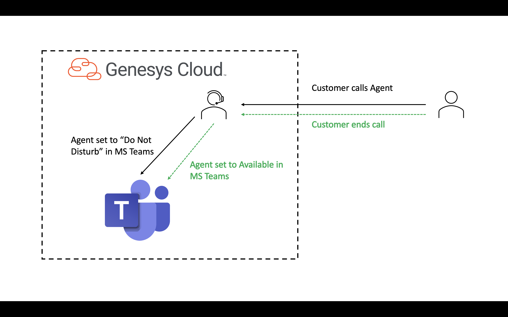

The following shows the end to end agent experience this blueprint enables.

To enable Microsoft Teams presence updates to be triggered from Genesys Cloud, you use several public APIs that are available from Genesys Cloud and Microsoft Graph. The following illustration shows the API calls between Genesys Cloud and Microsoft 365.

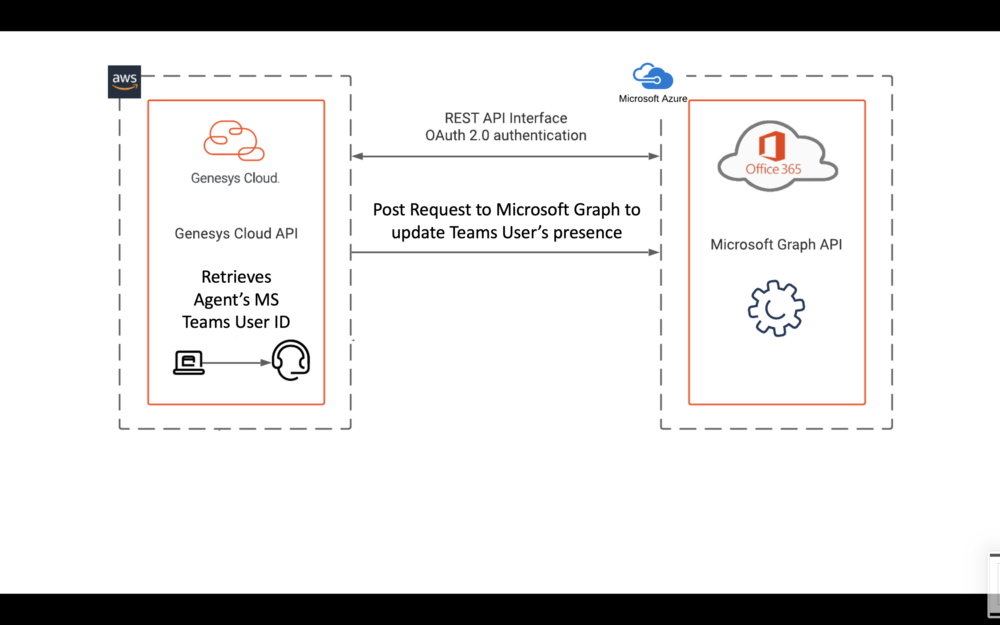

* [Solution components](#solution-components "Goes to the Solution components section")
* [Prerequisites](#prerequisites "Goes to the Prerequisites section")
* [Implementation steps](#implementation-steps "Goes to the Implementation steps section")
* [Additional resources](#additional-resources "Goes to the Additional resources section")

## Solution components
* **Genesys Cloud** - A suite of Genesys cloud services for enterprise-grade communications, collaboration, and contact center management. Contact center agents use the Genesys Cloud user interface.
* **Genesys Cloud API** - A set of RESTful APIs that enables you to extend and customize your Genesys Cloud environment.
* **Microsoft Teams** - A meeting and communication app. Microsoft Teams is the app that hosts the meeting for our solution.
* **Microsoft Graph API** - A unified API endpoint that enables developers to integrate services and devices with Microsoft products. This solution uses the API endpoint to update a Microsoft Teams user's presence.
* **Microsoft Azure** - A cloud computing platform that provides a variety of cloud services for building, testing, deploying, and managing applications through Microsoft-managed data centers. Microsoft Azure hosts Microsoft 365.
* **Postman** - An API platform for using APIs.

## Prerequisites

### Specialized knowledge

* Administrator-level knowledge of Genesys Cloud
* Administrator-level knowledge of Microsoft Azure Active Directory
* REST API authentication
* User-level knowledge of Postman

### Genesys Cloud account

* A Genesys Cloud 3 license. For more information, see [Genesys Cloud Pricing](https://www.genesys.com/pricing "Opens the pricing article").
* The Master Admin role in Genesys Cloud. For more information, see [Roles and permissions overview](https://help.mypurecloud.com/?p=24360 "Opens the Roles and permissions overview article") in the Genesys Cloud Resource Center.
* Microsoft Azure Active Directory SCIM integration for Microsoft Teams must be implemented in your Genesys Cloud org.  For more information, see [Configure the Microsoft Teams integration](https://help.mypurecloud.com/articles/configure-the-microsoft-teams-integration/) in the Genesys Cloud Resource Center.
* Event Orchestration must be activated for your Genesys Cloud org.

### Microsoft account

* An enterprise Azure Account is required.  Personal Azure accounts do not support the OAuth grant type of client_credentials used in this blueprint.
* Admininstrator-level role for Microsoft Azure Active Directory to set up authorization and grant permissions for Genesys Cloud.
* Microsoft Teams license for agents.

## Implementation steps
* [Configure the Microsoft Azure custom app](#configure-the-microsoft-azure-custom-app "Goes to the Configure the Microsoft Azure custom app section")
* [Configure Genesys Cloud](#configure-genesys-cloud "Goes to the Configure Genesys Cloud section")
* [Add a web services data actions integration](#add-a-web-services-data-actions-integration "Goes to the Add a web services data actions integration section")
* [Create an OAuth client for use with the Genesys Cloud data action integration](#create-an-oauth-client-for-use-with-the-genesys-cloud-data-action-integration "Goes to the Create an OAuth client for use with the Genesys Cloud data action integration section")
* [Add a Genesys Cloud data actions integration](#add-a-genesys-cloud-data-actions-integration "Goes to the Add a Genesys Cloud data actions integration section")
* [Load the supporting data actions](#load-the-supporting-data-actions "Goes to the Load the supporting data actions section")
* [Import the Find Teams User ID Action](#import-the-find-teams-user-id-action "Goes to the Import the Find Teams User ID Action section")
* [Import the Update Teams User Presence Action](#import-the-update-teams-user-presence-action "Goes to the Import the Update Teams User Presence Action section")
* [Import the Architect Workflows](#import-the-architect-workflows "Goes to the Import the Architect Workflows section")
* [Create the Event Orchestration Triggers](#create-the-event-orchestration-triggers "Create the Event Orchestration Triggers")
* [Additional resources](#additional-resources "Goes to the Additional resources section")

### Configure the Microsoft Azure custom app
To enable the Genesys Cloud instance to authenticate, read and write presence information from the Graph API for Microsoft Teams, register your custom application in Azure.

1. Log in to the Azure portal.
2. Navigate to **App registrations** and click **New registration**.

   

3. Enter a name for the application and select the preferred supported account type. Any account type works for a single Genesys Cloud organization. Click **Register**.

   

4. On the application's **Overview** page, copy the **Application (client) ID** and **Directory (tenant) ID** for later use.

   

5. Navigate to **Certificates & secrets** and click **New client secret**.

   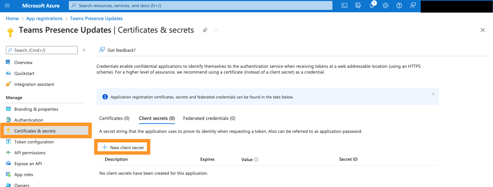

6. Copy the client secret value for later use.

   :::primary
   **Note:** You cannot view or retrieve the client secret value later.
   :::

   

7. Navigate to **API Permissions** and click **Add a permission**.

   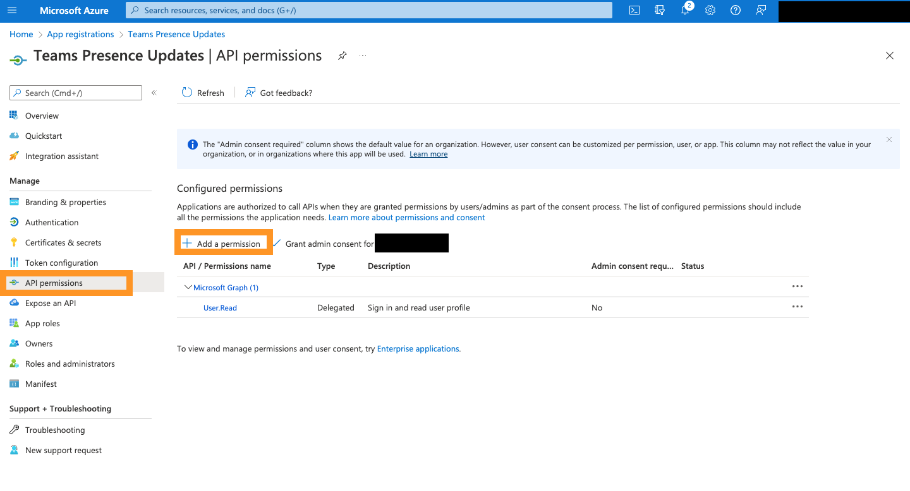

8. Click **Microsoft Graph**.

   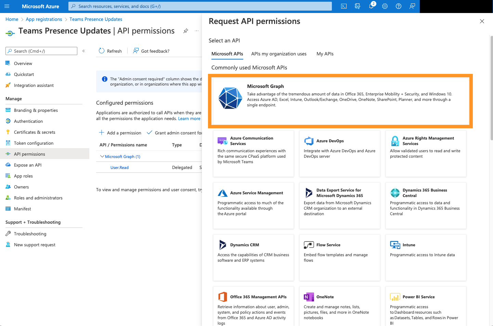

9. Click **Application Permissions**.

    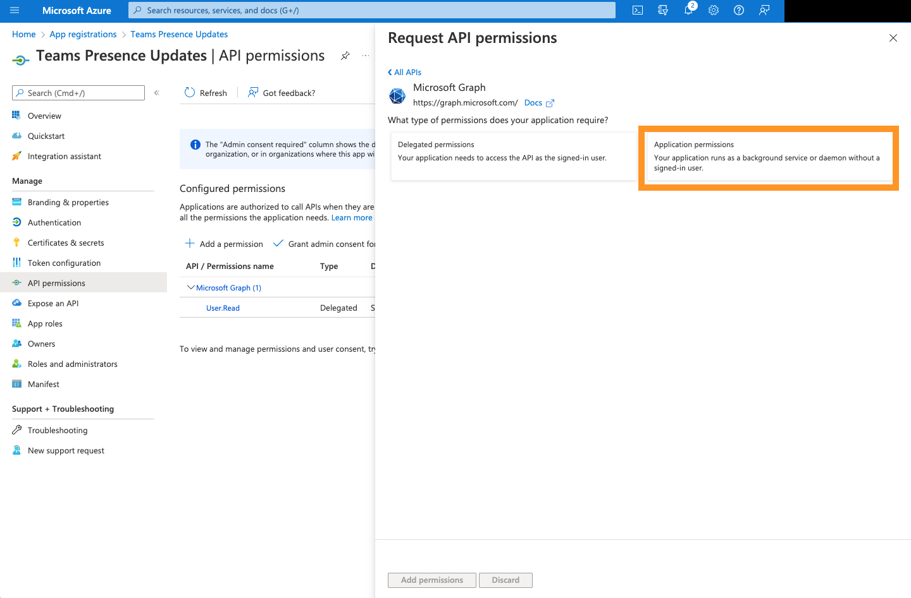

10. Search for **Presence**, expand the **Presence** section, select the **Presence.ReadWrite.all** permission, click **Add permissions**.

    

11. Click **Grant Admin Consent**.

        

12. Click **Yes** in the confirmation modal.

        

13. Admin consent granted.

        

### Configure Genesys Cloud

### Add a web services data actions integration
To enable communication from Genesys Cloud to Microsoft Azure and Microsoft Teams, you must add a web services data actions integration:

1. Install the **Web Services Data Actions** integration from Genesys Cloud. See [About the data actions integrations](https://help.mypurecloud.com/?p=209478 "Opens the data actions overview article").

   

2. Rename the web services data action and provide a short description.

   

3. Navigate to **Configuration** > **Credentials** and click **Configure**.

   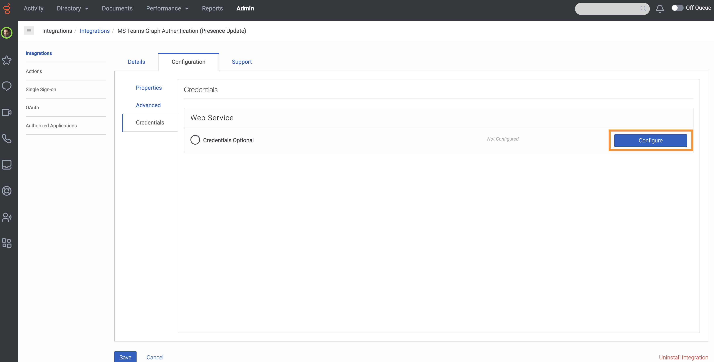

4. For **User Defined (OAuth)** credential type, add the following five fields, enter the required values, and then click **OK**:

* A: Set the client_id to the Application (client) ID from your Azure app.
* B: Set the client_secret to the Client Secret from your Azure app.
* C: Set the tenant_id to the Directory (tenant) ID from your Azure app.
* D: Set the scope to https://graph.microsoft.com/.default.
* E: Set the grant_type to client_credentials.

   

 5. Click **Save**

    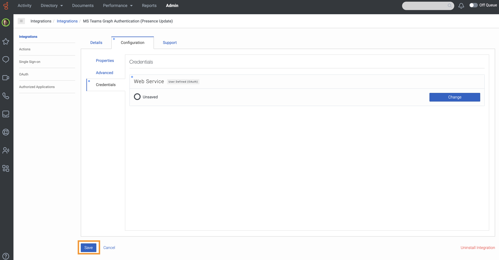

6. Import authentication data action

   You import an authentication data action into another data action. When you add a new web services data actions integration within an organization, Genesys Cloud creates a **Custom Auth** data action automatically.

   Navigate to **Integrations** > **Actions** and open the **Custom Auth** data action.

   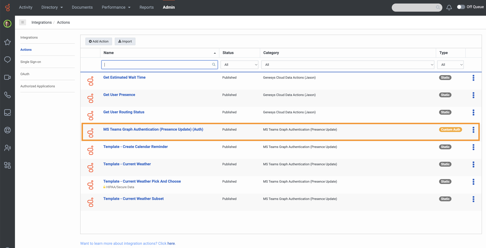

   1. At the bottom of the Custom Auth data action page, click **Viewing** to change the status of the data action from **Published** to **Draft**.
   2. Download the auth data action file *Office-365-Auth.customAuth.json* from the [update-ms-teams-presence-from-inbound-interaction](https://github.com/jasonwolfg/update-ms-teams-presence-from-inbound-interaction "Opens the GitHub repo") GitHub repository. Save this file to your local desktop to import it into Genesys Cloud.
   3. Click **Import** and browse to select the downloaded file.

      

   4. Click **Import Action** to import the custom auth data action.

      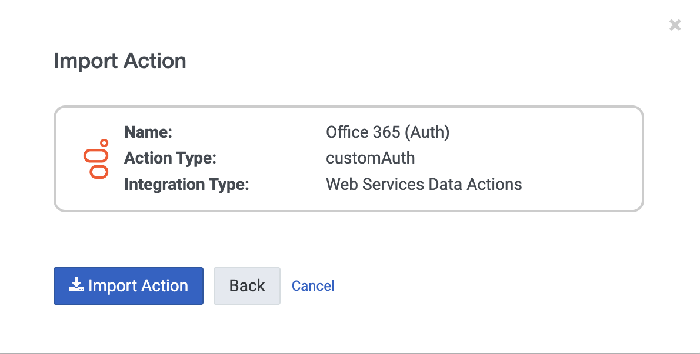

   5. Click **Save & Publish**.
      :::primary
      **Note:** Click **Yes** in the Publish Action window to publish the data action. The import action modifies only the data action configuration and not the data action contract.
      :::

6.  Return to the web services data action integration and verify that the data action is in **Active** status.

### Create a custom role for use with Genesys Cloud OAuth client

1. Navigate to **Roles/Permissions**.

   

2. Type a **Name** for your custom role.

  

3. Search and select the **processautomation>trigger>All Permissions** permissions and click **Save** to assign the appropriate permissions to your custom role.

:::primary
**Note:** Assign this role to your user record before creating the Genesys Cloud OAuth client.  The processautomation>trigger>All Permissions requires Event Orchestration to be activated in your Genesys Cloud organization.
:::

  

### Create an OAuth client for use with the Genesys Cloud data action integration
To enable a Genesys Cloud data action to make Public API requests on behalf of your Genesys Cloud organization, you must configure authentication with Genesys Cloud using an OAuth client.

1. Navigate to **Integrations** > **OAuth** and click **Add Client**.

   

2. Enter a name for the OAuth client and select **Client Credentials** as the Grant Type. Click the **Roles** tab and assign the roles for the OAuth client.

   :::primary
   **Note:** Select a custom role that includes the permission Messaging > Sms > Send. No default role includes this permission. To create a custom role, see the Custom roles information in [Roles and permissions overview](https://help.mypurecloud.com/?p=24360 "Opens the Roles and Permission overview article").
   :::

   

3. Click **Save** and record the Client ID and Client Secret values for later use.

   

### Add a Genesys Cloud data actions integration
To update a user's presence in Microsoft Teams, we need to get the Teams userId that corresponds to the Genesys Cloud agent answer the voice interaction. To do this requires a Genesys Cloud API call.  To enable this GC Public API call, you must add a Genesys Cloud data actions integration.

1. Install the **Genesys Cloud Data Actions** integration from Genesys Cloud. For more information, see [About the data actions integrations](https://help.mypurecloud.com/?p=209478 "Opens the Data Actions overview article").

   

2. Enter a name for the Genesys Cloud data action.

   

3. In the **Configuration** tab, select **Credentials** and click **Configure**.

   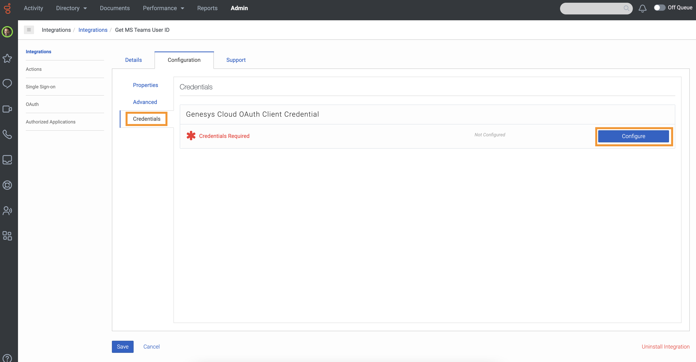

4. Enter the OAuth **Client ID** and **Client Secret** of your SCIM OAuth client used with your Active Directory Microsoft Teams SCIM integration listed in the Prerequisites>Genesys Cloud account section. Click **OK** and save the data action.

   

5. Navigate to the main Integrations page and set the Get MS Teams User ID data action integration to **Active**.

   

### Load the supporting data actions

To enable both the Gensys Cloud Public API call to get the Teams userId and the Microsoft Graph API call to update that Teams user's presence, you must import two more data actions.
* [Import the Find Teams User ID Action](#import-the-find-teams-user-id-action "Goes to the Import the Find Teams User ID Action section")
* [Import the Update Teams User Presence Action](#import-the-update-teams-user-presence-action "Goes to the Import the Update Teams User Presence Action section")

### Import the Find Teams User ID Action
The Find the Teams User ID data action uses the authenticated token supplied by other data actions to get the Teams User ID from the Genesys Cloud Public API.

1. Download the *Find-Teams-User-Id.custom.json* file from the [update-ms-teams-presence-from-inbound-interaction repo](https://github.com/jasonwolfg/update-ms-teams-presence-from-inbound-interaction "Opens the GitHub repo") GitHub repository. Save this file in your local desktop to import it into Genesys Cloud.

2. Navigate to **Integrations** > **Actions** and click **Import**.

   

3. Select the *Find-Teams-User-Id.custom.json* file and associate with the web services data action you created in the [Add a web services data actions integration](#add-a-web-services-data-actions-integration "Goes to the Add a web services data actions integration section") section and click **Import Action**.

   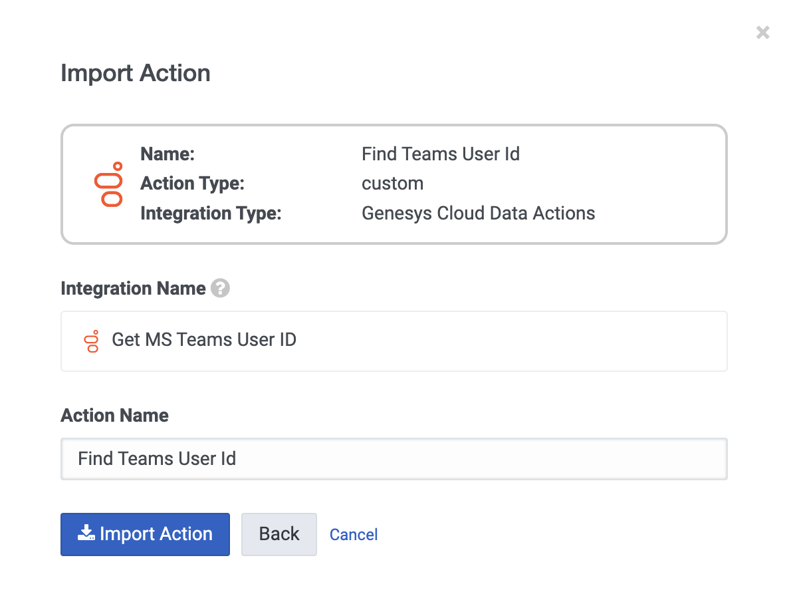

### Import the Update Teams User Presence Action
This data action calls the Microsoft Graph API to update the Teams user's presence.

1. Download the *Update-Teams-User-Presence.custom.json* file from the [update-ms-teams-presence-from-inbound-interaction repo](https://github.com/jasonwolfg/update-ms-teams-presence-from-inbound-interaction "Opens the GitHub repo") GitHub repository. Save this file in your local desktop to import it into Genesys Cloud.
2. Navigate to **Integrations** > **Actions** and click **Import**.

   

3. Select the *Update-Teams-User-Presence.custom.json* file and associate with the web services data action you created in the [Add a web services data actions integration](#add-a-web-services-data-actions-integration "Goes to the Add a web services data actions integration section") section and click **Import Action**.

   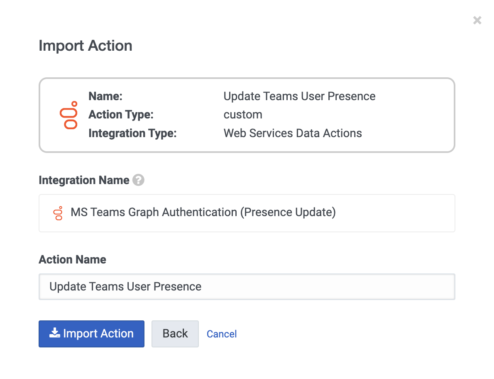

### Import the Architect Workflows
You need to import the *GC User Set MS Teams to DoNotDisturb_v8-0.i3WorkFlow* and *GC User Set MS Teams to Available_v4-0.i3WorkFlow* architect workflows that references the created data actions. These workflows will be called by the Event Orchestration triggers created in the next step.  When triggered, these workflows will call the Find Teams User ID data action, set the MS Teams User Id variable then update the MS Teams user's presence via the Graph API.  One workflow is triggered with an agent joins an inbound acd voice interaction and sets the MS Teams presence to DoNotDisturb.  The other workflow is triggered when the inbound acd interaction ends and sets the MS Teams presence to Available.  

1. Download the *GC User Set MS Teams to DoNotDisturb_v8-0.i3WorkFlow* file from the [update-ms-teams-presence-from-inbound-interaction](https://github.com/jasonwolfg/update-ms-teams-presence-from-inbound-interaction "Opens the GitHub repo") GitHub repository. Save this file to your local desktop to import it into Genesys Cloud.  

2. Navigate to **Admin** > **Architect** > **Flows:Workflow** and click **Add**.

   

3. Name your workflow and click **Create**.

  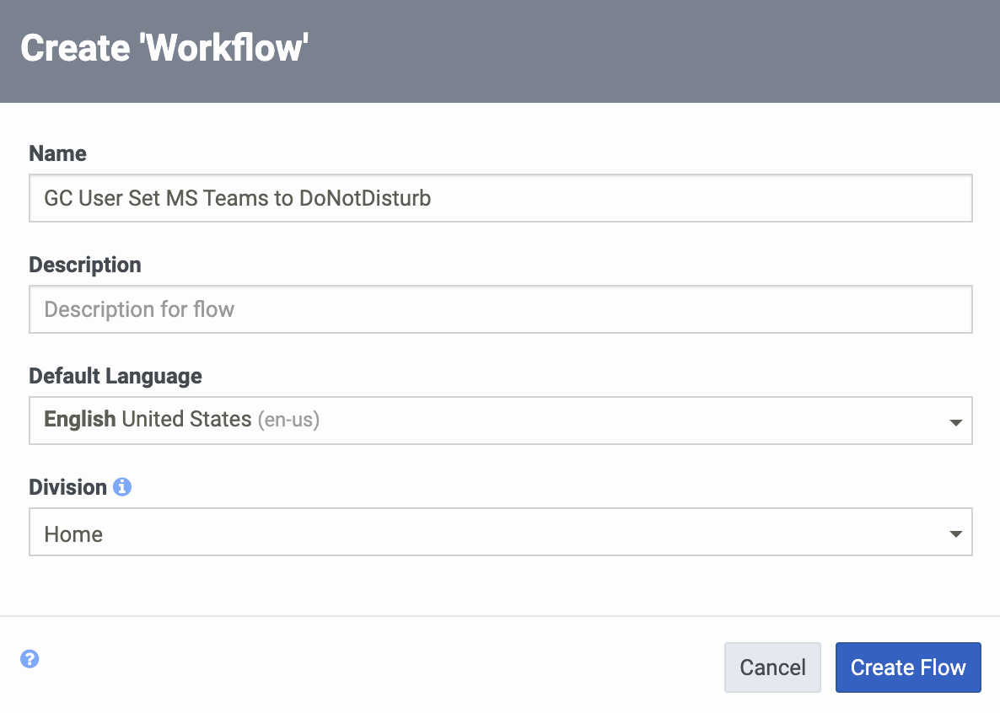

4. Expand the **Save** menu and click **Import**.

   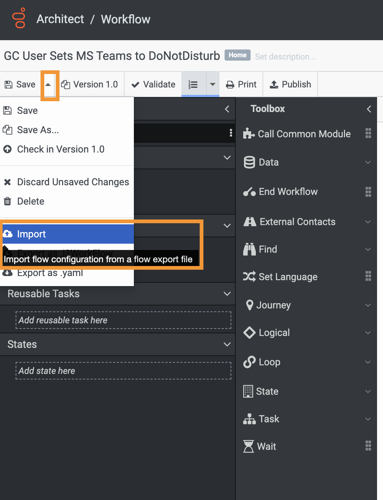

5. Select the downloaded *GC User Set MS Teams to DoNotDisturb_v8-0.i3WorkFlow* file.  Click **Import**.

   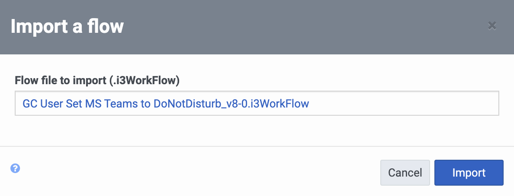

6. Review your workflow.  Copy the workflow ID from the URL and save it for the Event Orchestration Trigger creation.  Click **Save** then click **Publish**.

   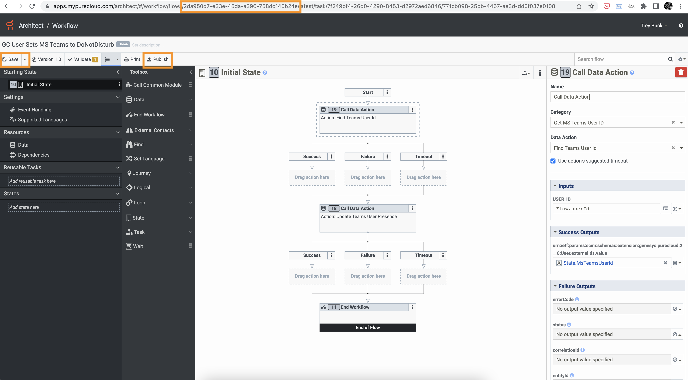

7. Download the *GC User Set MS Teams to Available_v4-0.i3WorkFlow* file from the [update-ms-teams-presence-from-inbound-interaction](https://github.com/jasonwolfg/update-ms-teams-presence-from-inbound-interaction "Opens the GitHub repo") GitHub repository. Save this file to your local desktop to import it into Genesys Cloud.  

8. Navigate to **Admin** > **Architect** > **Flows:Workflow** and click **Add**.

  

9. Name your workflow and click **Create**.

 

10. Expand the **Save** menu and click **Import**.

  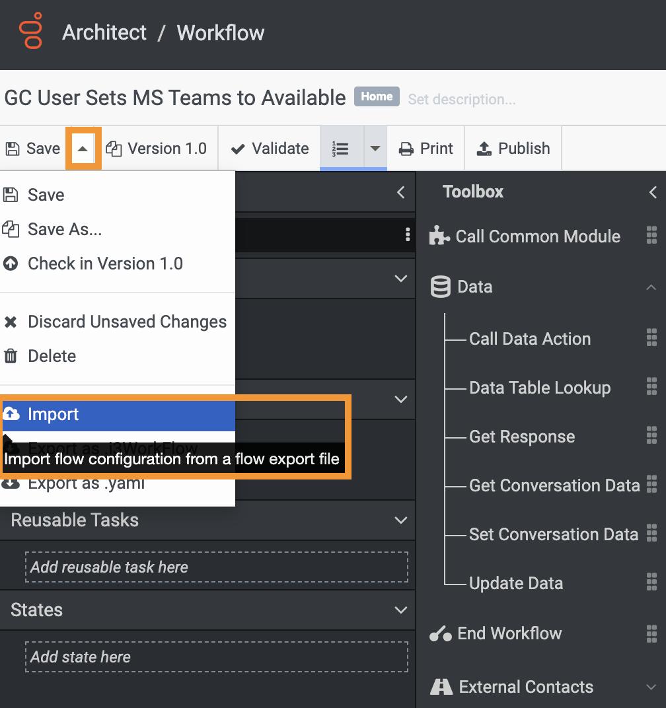

11. Select the downloaded *GC User Set MS Teams to Available_v4-0.i3WorkFlowI’m * file.  Click **Import**.

  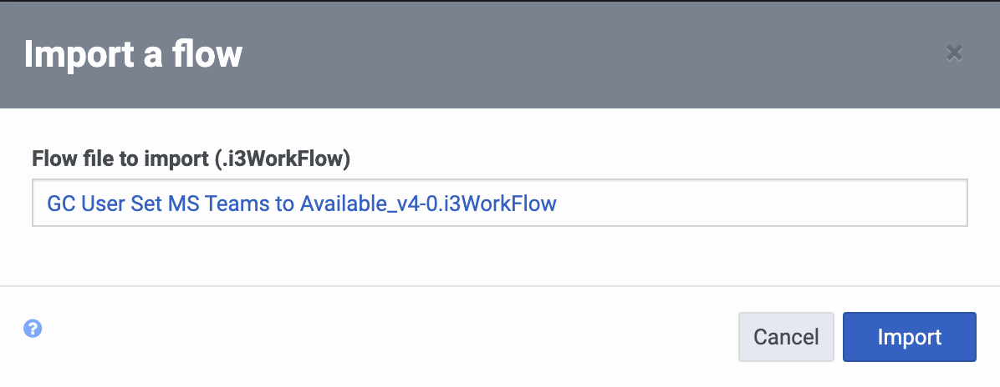

12. Review your workflow.  Copy the workflow ID from the URL and save it for the Event Orchestration Trigger creation.  Click **Save** then click **Publish**.

  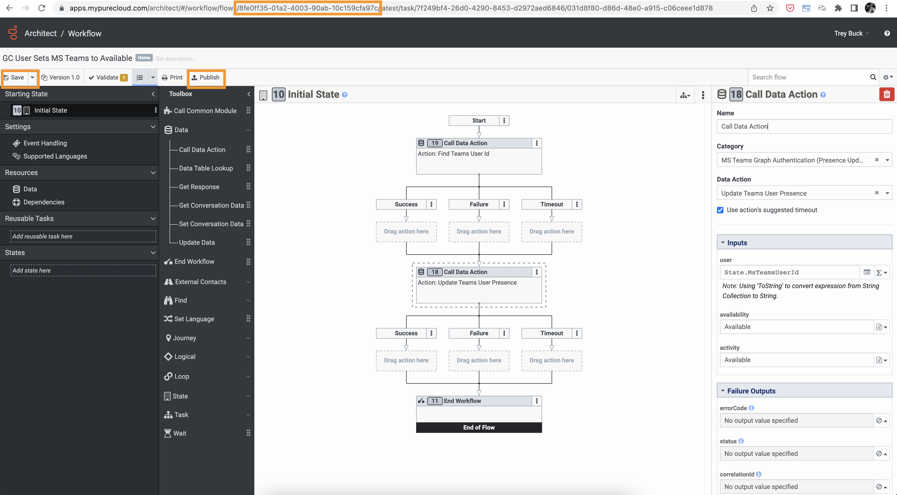

## Create the Event Orchestration Triggers
With the workflows created, the last step is to create the triggers to call the workflows.  For this, you will need Event Orchestration activated in your Genesys Cloud organization and you will need Postman running on your machine to make the necessary API calls to create the necessary Event Orchestration triggers.

1. Download the *Genesys Cloud Event Orchestration Trigger API's.postman_collection.json* file from the [update-ms-teams-presence-from-inbound-interaction](https://github.com/jasonwolfg/update-ms-teams-presence-from-inbound-interaction "Opens the GitHub repo") GitHub repository. Save this file to your local desktop to import it into Genesys Cloud.

2. Navigate to Postman and **Import**

   

3. Locate the *Genesys Cloud Event Orchestration Trigger API's.postman_collection.json* and click **Import**

   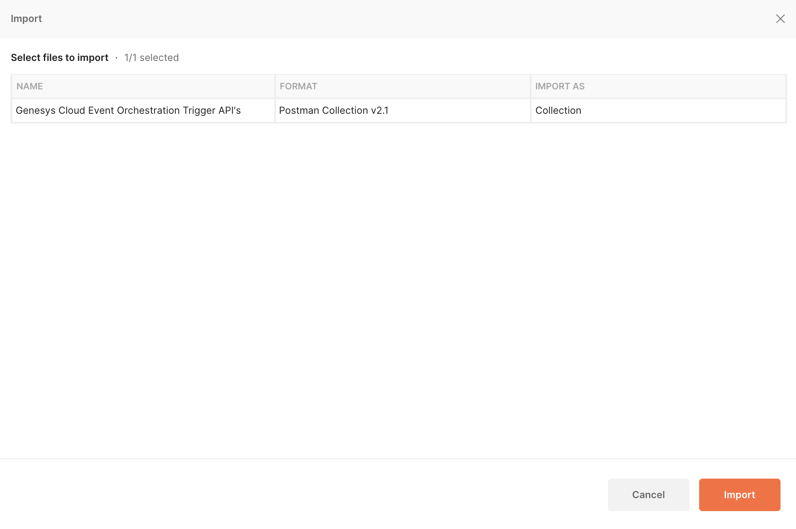

4. Expand the **Genesys Cloud Event Orchestration API's** folder and select **Genesys Cloud Client Credential Token Creation**.  Be sure to change your API domain to match the AWS region your Genesys Cloud organization is hosted.  The GC org in this screenshot is hosted in us-east-1.  On the **Authorization** tab, paste the **Client ID** from your OAuth client created in [Create an OAuth client for use with the Genesys Cloud data action integration](#create-an-oauth-client-for-use-with-the-genesys-cloud-data-action-integration "Goes to the Create an OAuth client for use with the Genesys Cloud data action integration section") in the **Username** field in Postman.  Paste the **Client Secret** from the same OAuth client into the **Password** field in Postman.  Click **Send**.

   :::primary
   **Note:** For a list of the API prefixes for the Genesys Cloud Public API, [click-here](https://developer.genesys.cloud/platform/api/ "Open Genesys Cloud Developer Center")
   :::

  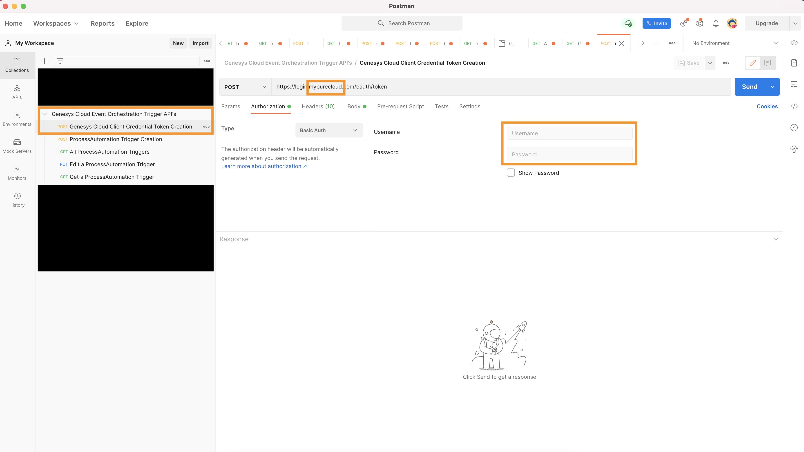

5. Copy the **access token** from the body of the response.

     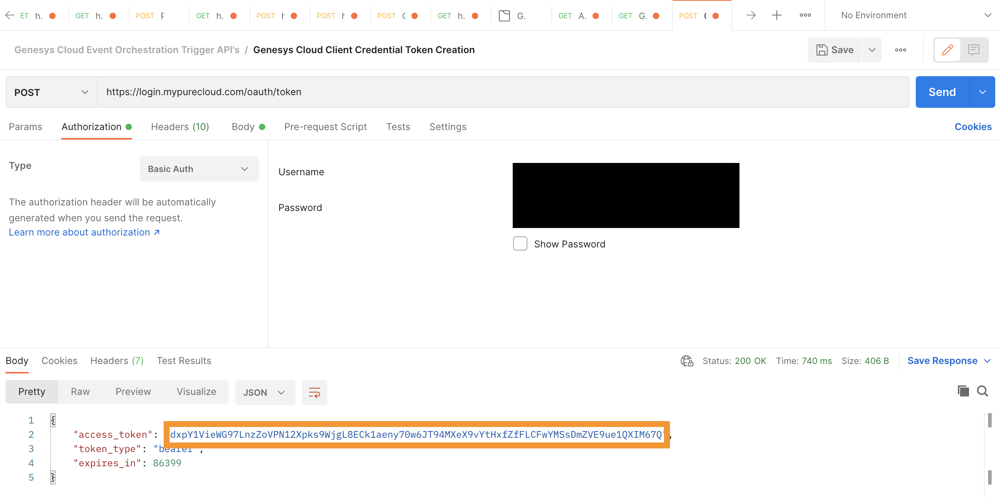

6. Open **ProcessAutomation Trigger Creation**.  On the **Authenication** tab, select **Bearer Token** and paste the access token from the previous step.

     

7. Click the **Body** tab, Be sure to change your API domain to match the AWS region your Genesys Cloud organization is hosted.  Replace **my-workflow-id** with the id of the **GC User Set MS Teams to DoNotDisturb** Architect workflow you created earlier in this blueprint.  Click **Send**.

   :::primary
   **Note:** For a list of the API prefixes for the Genesys Cloud Public API, [click-here](https://developer.genesys.cloud/platform/api/ "Open Genesys Cloud Developer Center")
   :::

    

8. The first trigger has been created.  To create the second one, change the **topicName** to **v2.detail.events.conversation.{id}.user.end**.  Replace **my-workflow-id** with the id of the **GC User Set MS Teams to Available** Architect workflow you created earlier in this blueprint.  Click **Send**.

    

## Additional resources

- [Update MS Teams Presence](https://docs.microsoft.com/en-us/graph/api/presence-setuserpreferredpresence?view=graph-rest-beta&tabs=http "Opens the Microsoft graph documentation") in the Microsoft Graph API Reference
- [Supported Genesys Cloud Notification Triggers](https://developer.genesys.cloud/notificationsalerts/notifications/available-topics "Opens the Genesys Cloud API Explorer") in the Genesys Cloud Developer Center
